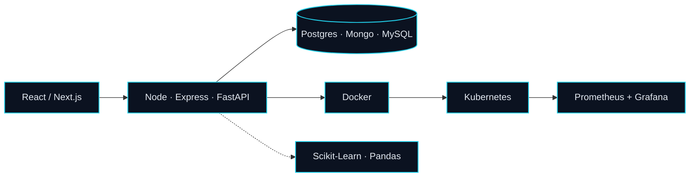

  

  Final-year CSE student at <b>Sri Sairam Engineering College</b> · I build complete systems, from the UI down to the infrastructure beneath it.

  
  
  

<h3 align="center">⚡ What I'm Up To</h3>

<table align="center" width="100%">
  <tr>
    <td width="33%" valign="top" align="center">
      <h4>🛠️ Building</h4>
      Complete systems, from the frontend UI to the backend infrastructure
    </td>
    <td width="33%" valign="top" align="center">
      <h4>☁️ Learning</h4>
      DevOps in depth — Docker, Kubernetes, observability
    </td>
    <td width="33%" valign="top" align="center">
      <h4>🤖 Exploring</h4>
      Machine Learning with Scikit-Learn and Pandas
    </td>
  </tr>
</table>

<h3 align="center">💼 Experience</h3>

  

 

  

<h3 align="center">🛠️ Tech Arsenal</h3>

<table align="center">
  <tr>
    <td align="right"></td>
    <td></td>
  </tr>
  <tr>
    <td align="right"></td>
    <td></td>
  </tr>
  <tr>
    <td align="right"></td>
    <td></td>
  </tr>
  <tr>
    <td align="right"></td>
    <td></td>
  </tr>
  <tr>
    <td align="right"></td>
    <td></td>
  </tr>
  <tr>
    <td align="right"></td>
    <td>
      
      
    </td>
  </tr>
</table>

<h3 align="center">🧭 How I Build</h3>

<h3 align="center">📊 GitHub Stats</h3>

  
  

  <i>"Life is like debugging code; every bug you fix reveals a new layer of complexity."</i>

  

