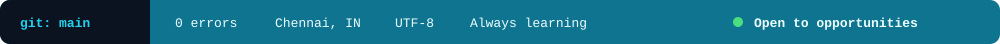

  

  Final-year CSE student at <b>Sri Sairam Engineering College</b> · I build multimodal and agent-based ML systems, and ship them as working products.

  
  
  

  🏆 <b>National hackathon finalist</b> (top 2% of 40,000+ at AI Impact Summit) &nbsp;·&nbsp; 🥇 <b>1st place, InnoFusion Hackathon</b> &nbsp;·&nbsp; 📜 <b>Patent holder</b> &nbsp;·&nbsp; 🌏 Open to on-site international internships

<h3 align="center">🎯 Focus</h3>

<table align="center" width="100%">
  <tr>
    <td width="33%" valign="top" align="center">
      <h4>👁️ Vision-Language Models</h4>
      YOLOv8 fine-tuning, CLIP, BLIP, image-text alignment, cross-modal pipelines
    </td>
    <td width="33%" valign="top" align="center">
      <h4>🤖 Agentic LLM Systems</h4>
      Multi-agent workflows with LangGraph, RAG, semantic search, OCR fallbacks
    </td>
    <td width="33%" valign="top" align="center">
      <h4>🚀 Shipping to Production</h4>
      FastAPI + React backends, Docker, and the tooling to deploy what I train
    </td>
  </tr>
</table>

<!--  -->

<h3 align="center">🧩 What I Can Do, and Where I've Done It</h3>

<table align="center" width="100%">
  <tr>
    <th align="left">Capability</th>
    <th align="left">Tools</th>
    <th align="left">Proven in</th>
  </tr>
  <tr>
    <td><b>Vision-language modeling</b></td>
    <td>CLIP · BLIP · image-text alignment</td>
    <td>Smart Rider Guardian</td>
  </tr>
  <tr>
    <td><b>Object detection &amp; fine-tuning</b></td>
    <td>YOLOv8 · PyTorch</td>
    <td>Smart Rider Guardian</td>
  </tr>
  <tr>
    <td><b>Multi-agent LLM orchestration</b></td>
    <td>LangGraph · LangChain</td>
    <td>AI Honeypot System</td>
  </tr>
  <tr>
    <td><b>Retrieval &amp; document intelligence</b></td>
    <td>RAG · PostgreSQL semantic search · Tesseract OCR</td>
    <td>KnowledgeHub AI</td>
  </tr>
  <tr>
    <td><b>Predictive modeling &amp; serving</b></td>
    <td>XGBoost · Scikit-Learn · FastAPI · Power BI</td>
    <td>Property Pulse</td>
  </tr>
  <tr>
    <td><b>Full-stack delivery</b></td>
    <td>React · FastAPI · Node · Docker</td>
    <td>KnowledgeHub AI and internships</td>
  </tr>
</table>

<h3 align="center">💼 Experience</h3>

  

 

  

<h3 align="center">🛠️ Tech Arsenal</h3>

<table align="center">
  <tr>
    <td align="right"></td>
    <td></td>
  </tr>
  <tr>
    <td align="right"></td>
    <td></td>
  </tr>
  <tr>
    <td align="right"></td>
    <td></td>
  </tr>
  <tr>
    <td align="right"></td>
    <td></td>
  </tr>
</table>

<b>Also working with:</b> LangChain · LangGraph · CLIP · BLIP · Tesseract OCR · XGBoost · Power BI · Kubernetes (learning)

  <i>"Life is like debugging code; every bug you fix reveals a new layer of complexity."</i>

  

